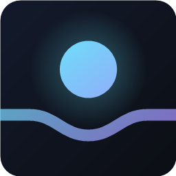

<div align="center">



# Antigravity Maestro

**Run Antigravity's models across Copilot Chat, Claude Code and Codex — from a pool of Google accounts that rotates itself when quota runs out.**

[](https://marketplace.visualstudio.com/items?itemName=husamettinulutas.antigravity-maestro)
[](https://marketplace.visualstudio.com/items?itemName=husamettinulutas.antigravity-maestro)
[](https://code.visualstudio.com/)
[](LICENSE)

[Installation](#installation) · [Quick start](#quick-start) · [Models](#models) · [Gateway API](#gateway-api) · [Configuration](#configuration) · [Security](#security)

</div>

---

## Overview

Antigravity Maestro turns the Google accounts you already have into a single, self-managing model
pool. Sign in once per account; the extension tracks each one's quota, serves every request from
whichever account can afford it, and exposes the whole pool to three clients at once — natively
inside Copilot Chat, and over a local OpenAI/Anthropic-compatible gateway for Claude Code and Codex.

> **Not affiliated with, endorsed by, or sponsored by Google.** "Antigravity" and "Gemini" are
> trademarks of Google LLC. The extension talks to the same endpoints the Antigravity client uses,
> authenticated with credentials you sign in with yourself.

## Capabilities

| | |
|---|---|
| **Account pool** | Add any number of Google accounts. Refresh tokens live in VS Code SecretStorage — never in settings, never in plaintext on disk. |
| **Quota telemetry** | Remaining quota per model, reset countdowns, subscription tier, and both the 5-hour and weekly rolling windows, for every account. |
| **Automatic rotation** | A rate-limited or exhausted account hands off to the next eligible one, and the in-flight request is retried transparently. |
| **Copilot Chat** | Models register as a first-class provider in Copilot's picker. Requests run in-process — no proxy hop. |
| **Claude Code & Codex** | A loopback gateway speaks the Anthropic and OpenAI wire formats; each agent's own config is rewritten, with backups, to point at it. |
| **Commit messages** | Choose which model writes VS Code's generated commit messages instead of spending Copilot credits on them. |
| **Usage accounting** | Token spend per account and per model, with retained quota history. |

## Installation

From the VS Code Marketplace:

```bash
code --install-extension husamettinulutas.antigravity-maestro
```

Or search for **Antigravity Maestro** in the Extensions view. Requires VS Code 1.104 or newer.

## Quick start

1. Open the **Antigravity Maestro** view in the activity bar.
2. Select **Add account** and complete Google sign-in in your browser. Repeat for each account —
   the first one becomes active.
3. Wire up the clients you use:

   | Client | Action |
   |---|---|
   | **Copilot Chat** | **Set up** on the Copilot Chat row, then **Manage Models → Antigravity Maestro** in the model picker, and tick the models you want. |
   | **Claude Code** | **Use model** on the Claude Code row (or run `Antigravity Maestro: Use Model in Claude Code`), then restart any running session. |
   | **Codex** | **Use model** on the Codex row. On Windows, restart VS Code once so Codex picks up the key. |

**Restore** returns any agent to its own provider. Every config file is copied to
`<file>.antigravity-maestro-backup` before the first write.

## Models

Model ids are passed through exactly as upstream reports them — nothing is renamed. Where a model
exposes separate reasoning tiers, those are distinct ids upstream with different thinking budgets,
so they appear as distinct models here:

```
gemini-3.1-pro-high      gemini-3.5-flash-high      claude-opus-4-6-thinking
gemini-3.1-pro-low       gemini-3.5-flash-medium    claude-sonnet-4-6-thinking
gemini-3-flash           gemini-3.5-flash-low       gpt-oss-120b-medium
```

The authoritative list comes from each account's own quota response, so it reflects what Google
actually serves that account.

## Gateway API

Claude Code and Codex speak HTTP, so the extension runs a server on `127.0.0.1:8765` (configurable),
protected by a bearer key generated per install and held in SecretStorage. The three supported
integrations are wired up for you by **Use model** — the gateway is there for everything else.

| Route | Protocol | Client |
|---|---|---|
| `POST /v1/messages` | Anthropic Messages (streaming + blocking) | Claude Code |
| `POST /v1/responses` | OpenAI Responses | Codex |
| `POST /v1/chat/completions` | OpenAI Chat Completions | generic clients |
| `GET /v1/models` | model list | both |
| `GET /health` | liveness (unauthenticated) | you |

```bash
curl -s http://127.0.0.1:8765/health
curl -s http://127.0.0.1:8765/v1/models -H "authorization: Bearer $KEY"
```

Run `Antigravity Maestro: Copy Local Gateway URL and Key` to obtain `$KEY`, or use **Copy URL + key**
on the gateway row to point a CLI, a script, or another editor at the pool. **Restart** rebinds the
server after a port change, or if requests stop going through.

Copilot Chat does not use the gateway; those requests never leave the extension host.

## Configuration

| Setting | Default | Purpose |
|---|---|---|
| `antigravityMaestro.gateway.port` | `8765` | Preferred gateway port; the next free port is used if it is taken. |
| `antigravityMaestro.gateway.autoStart` | `true` | Start the gateway with VS Code. |
| `antigravityMaestro.rotation.strategy` | `highest-quota-first` | `manual`, `round-robin`, or `highest-quota-first`. |
| `antigravityMaestro.rotation.cooldownMinutes` | `15` | Fallback cooldown after a rate limit. |
| `antigravityMaestro.quota.autoRefreshMinutes` | `10` | Background quota refresh (`0` disables it). |
| `antigravityMaestro.upstreamProxyUrl` | `""` | HTTP(S) proxy for all Google traffic. |
| `antigravityMaestro.oauth.clientId` / `.clientSecret` | `""` | Sign in with your own approved OAuth client. |
| `antigravityMaestro.claudeCode.settingsScope` | `user` | Write `~/.claude/settings.json` or the workspace's `.claude/settings.local.json`. |
| `antigravityMaestro.claudeCode.smallFastModel` | `""` | Cheaper model for Claude Code's background tasks. |
| `antigravityMaestro.codex.configPath` | `""` | Alternative `config.toml` path. |

Under `manual` rotation the active account never changes on its own. Under the other strategies it
changes only when the account you picked cannot serve the request.

## Architecture

```
Copilot Chat ──► LanguageModelChatProvider ─┐
                                            ├─► account lease ──► Cloud Code endpoints
Claude Code ──► /v1/messages ──┐            │      (rotation,        (streamGenerateContent)
Codex ────────► /v1/responses ─┴► gateway ──┘       quota, tokens)
```

The account lease decides which signed-in account serves each request, refreshes its access token as
needed, and records the token spend. Protocol translation is confined to `src/protocol/`, so a
change to one wire format never touches the others.

## Security

- **Refresh tokens** are stored in VS Code SecretStorage. They are never written to settings, logs,
  or workspace files.
- **The gateway** binds to `127.0.0.1` only and requires a bearer key generated per install.
- **OAuth client credentials** are injected at build time from a git-ignored `.env` and are never
  committed. See [Building from source](#building-from-source).
- **Agent config files** are backed up to `<file>.antigravity-maestro-backup` before any write, and
  **Restore** reverts them.

Report a vulnerability privately through
[GitHub Security Advisories](https://github.com/husamettinulutas/antigravity-maestro/security/advisories/new).

## Building from source

```bash
git clone https://github.com/husamettinulutas/antigravity-maestro.git
cd antigravity-maestro
npm install
cp .env.example .env      # then fill in your OAuth client
```

| Command | Purpose |
|---|---|
| `npm run watch` | esbuild in watch mode; press F5 to launch the Extension Development Host. |
| `npm run compile` | Type-check only. |
| `npm test` | Protocol mapper tests. |
| `npm run build` | Production bundle. |
| `npm run package` | Build a `.vsix`. |

`.env` supplies `AGM_OAUTH_CLIENT_ID` and `AGM_OAUTH_CLIENT_SECRET`, which `esbuild.js` bakes into
the bundle at build time. Building without it is supported — the result simply has no built-in
client, and sign-in then requires the `antigravityMaestro.oauth.*` settings. Google issues the Cloud
Code scopes only to approved clients, so the client you supply must be one of them.

## Contributing

Issues and pull requests are welcome at
[github.com/husamettinulutas/antigravity-maestro](https://github.com/husamettinulutas/antigravity-maestro).
Run `npm run compile && npm test` before opening a pull request, and never commit credentials.

## License

[MIT](LICENSE) © Hüsamettin Ulutaş
